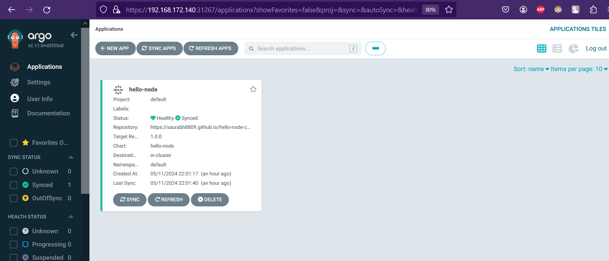
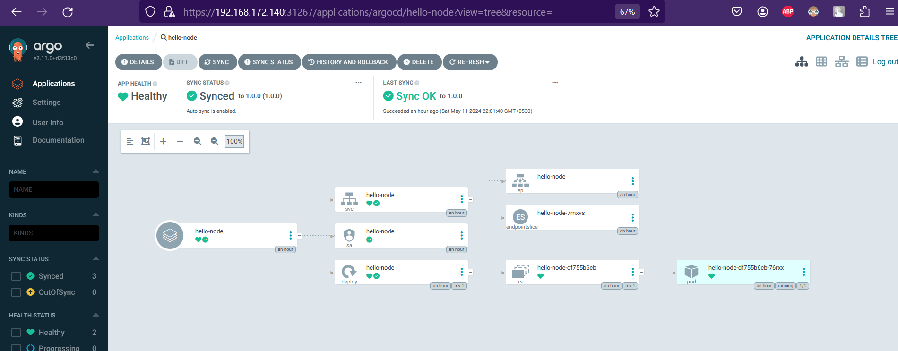

# saurabh8809.github.io

# This repository may be used to leverage ArgoCD to deploy a basic NodeJS application on your Kubernetes cluster.

- **Install prerequisite before proceeding**

    ```bash
    # ArgoCD Installation 
    $ kubectl create namespace argocd
    $ kubectl apply -n argocd -f https://raw.githubusercontent.com/argoproj/argo-cd/stable/manifests/install.yaml

    # Change service type of ArgoCD to NodePort for accessing argocd form outside of the cluster 
    $ kubectl patch svc argocd-server -n argocd -p '{"spec": {"type": "NodePort"}}'

    # Helm installation 
    $ curl -fsSL -o get_helm.sh https://raw.githubusercontent.com/helm/helm/main/scripts/get-helm-3
    $ chmod 700 get_helm.sh
    $ ./get_helm.sh
    ```

- **Clone the repo and apply necessary YAML to deploy helm chart**

    ```bash
    $ git clone https://github.com/saurabh8809/saurabh.github.io
    $ cd saurabh8809.github.io/
    
    # Now apply argocd yaml file to install helm chart form git repo
    $ kubectl apply -f argoCD.yaml
    ```

- **Verify the Installation**

  ```bash
    # Verify ArgoCD application got deployed properly 
    $ kubectl get application -A
      NAMESPACE   NAME         SYNC STATUS   HEALTH STATUS
      argocd      hello-node   Synced        Healthy                # Healthy shows that our application got deployed successfully

    # Verify the pods are running or not 
    $ kubectl get pods
      NAME                         READY   STATUS    RESTARTS   AGE
      hello-node-df755b6cb-76rxx   1/1     Running   0          20m
  ```

  - Verification using ArgoCD GUI

    ```bash
    # Get the port number on which argocd is listening
    $ kubectl  get svc -n argocd
      NAME                                      TYPE        CLUSTER-IP       EXTERNAL-IP   PORT(S)                      AGE
      argocd-applicationset-controller          ClusterIP   10.152.183.82    <none>        7000/TCP,8080/TCP            22h
      ....
      argocd-server                             NodePort    10.152.183.146   <none>        80:30488/TCP,443:31267/TCP   22h   # on port 31267 argocd is listening
      ....

    # Extract the password for argocd 
    $ kubectl -n argocd get secret argocd-initial-admin-secret -o jsonpath="{.data.password}" | base64 -d; echo
      mMY1V8iqUTdSBrd9                          # take a note of this password 
    $
    ```
    open URL - https://\{cluster_ip\}:\{argocd_port\} and use username `admin` and password which you got in previous command.
    You will see a page like below 
    

    Clieck on `hello-node` project, you will be able to see all K8S object related to `hello-node` helm chart

    

- **Verify the NodeJS Application using web browser**

   - Get port on which our NodeJS application is listening

  ```bash
  $ kubectl get svc -n default
    NAMESPACE     NAME                                      TYPE        CLUSTER-IP       EXTERNAL-IP   PORT(S)                      AGE
    default       hello-node                                NodePort    10.152.183.202   <none>        3000:32157/TCP               11s  # on 32157 our node application is listening
    default       kubernetes                                ClusterIP   10.152.183.1     <none>        443/TCP                      46h

  ```

  open URL - http://\{cluster_ip\}:\{nodejs_app_port\} If everything went according to plan, you should see the screen below.
  


# You have successfully deployed NodeJS application on k8s using ArgoCD 

